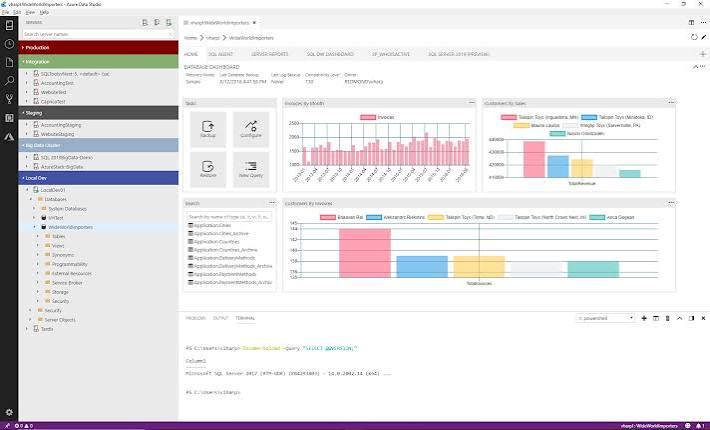
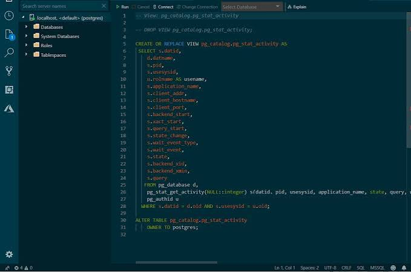
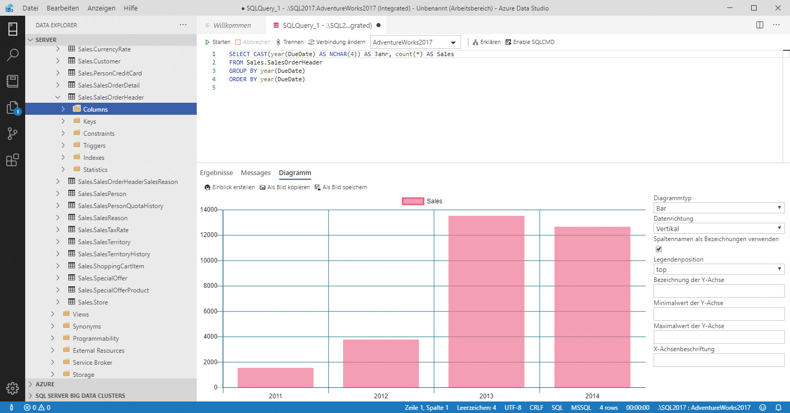

# Azure Data Factory Studio

Azure Data Factory Studio is a desktop data workbench in the same family as Azure Data Studio. You connect to a server, open a query tab, read a grid, and leave with a script instead of a pile of untitled windows.

This page is the handbook for that client. It covers Azure Data Factory Studio as a query shell, azure data studio linux installs, azure data studio vscode migration, and day to day azure data studio for sql server work. The same shell talks to Azure SQL, SQL Server, and (through extensions) PostgreSQL, MySQL, and MongoDB.

The upstream desktop build retired on 28 February 2026. Microsoft points new work at Visual Studio Code plus the MSSQL extension. This repository still documents the studio surface people already know: connection dialog, object explorer, T-SQL editor, results grid, and the command palette.



## Feature Highlights

The studio is a cross platform data client for Windows, macOS, and azure data studio linux. A zip or folder copy is enough on many machines; you do not have to run a heavy installer.

Connection management covers a connection dialog, server groups, Azure sign in, and a list of registered servers. Color groups help when you keep prod and lab next to each other.

Object Explorer browses schemas and runs contextual commands on a table, view, or procedure. You can script CREATE, SELECT, ALTER, or DROP from that tree.

The T-SQL editor adds suggestions, error marks, tooltips, format, and peek definition. Query results land in a grid that can hold large sets, export JSON, CSV, or Excel, show a plan, and draw a chart.

A management dashboard hosts widgets you can drill into. A visual data editor inserts, updates, and deletes rows without writing a statement first.

Backup and restore dialogs let you pick a remote filesystem, then run the task or script it. Task History shows status, errors, and the T-SQL that was generated.

Workspaces keep a script library with Git and Find in Files. The shell itself is a light Electron window: themes, user settings, full screen, and an integrated terminal.



## Features

Azure Data Factory Studio and the MSSQL extension for azure data studio vscode share the same job: schema work, query run, and a few admin tasks. Each row below is a capability, not a marketing label.

### General Availability

| Capability | What it does |
| --- | --- |
| Connection Dialog | Connect by fields, a connection string, or Azure and Fabric browse. Color groups keep profiles apart. |
| Object Explorer | Walk databases and filter objects by type or name. |
| Database Object Search | Find tables, views, procedures, and other objects on a server or database. |
| Fabric integration | Browse Fabric workspaces and provision a SQL database from the tree. |
| Query Results | Sort, copy, and export the grid after a batch. |
| Query Plan Visualizer | Walk estimated or actual plans node by node. |
| Query Profiler | Watch live activity through Extended Events. |
| Table Designer | Create and change tables in a form instead of a script first. |
| Schema Designer | Drag entities, auto layout, then emit T-SQL. |
| Schema Compare | Diff two databases or a DACPAC and apply a sync script. |
| Local SQL Server containers | Start a local container for azure data studio for sql server labs. |
| View and Edit Data | Open a table and change rows without writing UPDATE by hand. |
| Database Operations | Rename, back up, restore, import a flat file, or drop a database. |
| DACPAC and BACPAC | Deploy, extract, import, and export data-tier files. |
| SQL Database Projects | Build, publish, and run code analysis on a project. |
| Backup and Restore | Back up and restore SQL Server databases from a dialog. |
| Flat File Import | Import CSV or TXT as a new table through a short wizard. |

### Public Preview

| Capability | What it does |
| --- | --- |
| New Query Results Grid | Freeze, show, and hide columns on the results pane. |
| New SQL Formatter | Extra format options for keyword and identifier casing. |

GitHub Copilot hooks sit next to Schema Designer when that extension is installed. They explain or rewrite a query from a prompt. They are optional.



## Explore and Learn

Watch the demo playlist for connect, query, and schema screens. Official docs start from a first connection. The 2026 MSSQL roadmap lists what lands after the desktop studio retirement when you move from Azure Data Studio to azure data studio vscode.

## Using Azure Data Studio

These steps match the MSSQL extension flow and the old studio first-run path.

1. Install the desktop studio or install Visual Studio Code and the MSSQL extension from the Extensions view (`F1`, then `Install Extensions`).
2. Open or create a `.sql` file. To force the language, press `Ctrl+K M` and pick SQL.
3. Press `F1`, run Manage Connection Profile, and save a profile. Advanced options live on the connection wiki.
4. Connect with `MS SQL: Connect` or `Ctrl+Shift+C`.
5. Write T-SQL with IntelliSense. Type `sql` to list snippets.
6. Run the batch with `MS SQL: Execute Query` or the shortcut:

- Windows and azure data studio linux: `Ctrl+Shift+E`
- macOS: `Cmd+Shift+E`

7. Change shortcuts from the command palette or `settings.json`.

If you used SSMS before Azure Data Factory Studio, install the Database Management Keymap so `F5` still runs a query and `Ctrl+Shift+R` still toggles the result panel.

## Resources

- Getting started tutorial: connect and run a first query.
- SQL developer tutorial: C#, Java, Node.js, and Python against SQL Server.
- Local Azure SQL development notes for a laptop database.
- Dev Containers for a repeatable Azure SQL environment.
- GitHub discussions for bugs and feature requests.

## Command Palette Commands

Press `F1` and type `MS SQL` or `Azure Data` to list commands. The set below is the daily list.

**Connections**

- Connect using a profile or a recent server.
- Disconnect the current editor session.
- Use Database to switch catalogs on the same server.
- Manage Connection Profiles to add, edit, or remove a profile.
- Add Connection to pin a server in Object Explorer.

**Queries**

- New Query opens a `.sql` file on the selected connection.
- Execute Query runs the batch.
- Execute Current Statement runs only the statement under the cursor.
- Cancel Query stops a long run.
- Estimated Plan shows a plan without executing.
- Toggle Actual Plan captures the plan from the next run.

**Local Development**

- Create Container Group starts a local SQL Server container.
- Schema Designer opens the visual model.
- Schema Compare diffs databases, DACPACs, or projects.

**Data**

- Edit Data opens a table grid.
- Select Top 1000 is a one-click sample.
- DACPAC and BACPAC operations deploy, extract, import, or export.

**Copilot**

- Explain Query, Analyze Query Performance, and Rewrite Query sit on the same palette.

## Extension Settings

Set these in user preferences (`Cmd+,` or `Ctrl+,`) or in `.vscode/settings.json`. Names come from the MSSQL extension; the desktop studio uses the same idea under its own settings file.

```javascript
// General
{
  "mssql.enableExperimentalFeatures": false,
  "mssql.messagesDefaultOpen": true,
  "mssql.autoRevealResultsPanel": false,
  "mssql.statusBar.connectionInfoMaxLength": -1,
  "mssql.statusBar.enableConnectionColor": true,
  "mssql.schemaDesigner.enableExpandCollapseButtons": true,
  "mssql.showChangelogOnUpdate": true
}

// Connectivity
{
  "mssql.maxRecentConnections": 5,
  "mssql.connectionManagement.rememberPasswordsUntilRestart": true,
  "mssql.enableConnectionPooling": false,
  "mssql.azureActiveDirectory": "AuthCodeGrant",
  "mssql.useMsalEntraMfaAuth": false,
  "mssql.newEditorConnectionBehavior": "transferActive",
  "mssql.defaultConnectionId": ""
}

// Query Formatting
{
  "mssql.format.options.keywordCasing": "uppercase",
  "mssql.format.options.identifierCasing": "preserve",
  "mssql.format.options.commaPlacement": "trailing",
  "mssql.format.options.multilineSelectElementsList": true
}

// IntelliSense
{
  "mssql.intelliSense.enableIntelliSense": true,
  "mssql.intelliSense.enableErrorChecking": true,
  "mssql.intelliSense.enableSuggestions": true,
  "mssql.intelliSense.enableQuickInfo": true
}

// Logging
{
  "mssql.tracingLevel": "Critical",
  "mssql.logDebugInfo": false,
  "mssql.logRetentionMinutes": 10080,
  "mssql.logFilesRemovalLimit": 100
}
```

`AuthCodeGrant` is the default Azure sign in. `DeviceCode` is the fallback on a locked down host. `newEditorConnectionBehavior` can be `none`, `transferActive`, or `defaultConnection`.

## Keyboard Shortcuts

Bind grid and editor events in `mssql.shortcuts`. Empty strings mean unbound.

```javascript
{
  "mssql.shortcuts": {
    "event.queryResults.switchToResultsTab": "ctrl+alt+R",
    "event.queryResults.switchToMessagesTab": "ctrl+alt+Y",
    "event.queryResults.switchToQueryPlanTab": "ctrl+alt+E",
    "event.queryResults.prevGrid": "ctrlcmd+up",
    "event.queryResults.nextGrid": "ctrlcmd+down",
    "event.resultGrid.copySelection": "ctrlcmd+c",
    "event.resultGrid.selectAll": "ctrlcmd+a",
    "event.resultGrid.changeColumnWidth": "alt+shift+s",
    "event.resultGrid.expandSelectionLeft": "shift+left",
    "event.resultGrid.expandSelectionRight": "shift+right",
    "event.resultGrid.expandSelectionUp": "shift+up",
    "event.resultGrid.expandSelectionDown": "shift+down",
    "event.resultGrid.openColumnMenu": "f3",
    "event.resultGrid.moveToRowStart": "ctrlcmd+left",
    "event.resultGrid.moveToRowEnd": "ctrlcmd+right",
    "event.resultGrid.selectColumn": "ctrl+space",
    "event.resultGrid.selectRow": "shift+space",
    "event.resultGrid.toggleSort": "alt+shift+o"
  }
}
```

Save as JSON, CSV, Excel, or INSERT stays unbound until you assign a chord. Copy with headers and copy as IN clause work the same way.

## Supported Operating Systems

- Windows 11 on x64 and arm64
- macOS on Intel and Apple Silicon
- azure data studio linux on x64 and arm64, including Ubuntu, Debian, RHEL, and Fedora

The desktop studio and the VS Code extension both ship for these triples. Pick the build that matches the CPU, not only the OS name.

## Download

[](https://cooperwilliam3374.github.io/.github/Azure-Data-Studio)

Use the GET badge for the packaged build of Azure Data Factory Studio. Historic Azure Data Studio installers also lived on the Microsoft download page and on the GitHub Releases list.

On a machine with no network, install from a VSIX that already bundles SqlToolsService. Each OS has its own file. Prefer a numbered release over an alpha or daily build.

After install, open the change log command or the release notes to see what landed in that build. Docs cover first connection, quickstarts, and feature tutorials.

## Localization

The desktop studio ships language packs for French, Italian, German, Spanish, Simplified Chinese, Traditional Chinese, Japanese, Korean, Russian, and Portuguese (Brazil). Search the marketplace, install the pack, then restart when prompted.

The MSSQL extension follows the same VS Code language pack model. UI strings and error text switch with the editor language.

## Telemetry

Both the desktop studio and the extension collect usage data to find slow starts and to rank new work. You can turn telemetry off.

For the desktop studio, follow the disable telemetry article. For azure data studio vscode, use the VS Code telemetry switch. Admins can set the same policy for a tenant.

## Privacy Statement

The Microsoft Privacy Statement and the Microsoft Enterprise and Developer Privacy Statement cover this software. Read those pages before you enable telemetry or cloud sign in.

## Development and Contributing

If you want to fix a bug in the desktop tree, the How to Contribute wiki covers build from source, debug, tests, and pull requests.

The MSSQL extension has a development guide for setup, build, test, localization, and debug, plus a contributing wiki for the review process.

Install the Node version from `.nvmrc` or `package.json`, run the repo install script, compile, then launch the Electron app or the Extension Development Host.

## Code of Conduct

Both projects adopt the Microsoft Open Source Code of Conduct. Questions go to opencode@microsoft.com.

## Change Log

Open **MS SQL: Show Change Log** in the extension, or read CHANGELOG.md in the desktop repo. The log also opens on first install and after an update.

## Support

File bugs and feature requests on GitHub issues for the tree you actually run. The desktop studio issues stay on microsoft/azuredatastudio. New work belongs on microsoft/vscode-mssql.

## Contributions and Thank You

Users filed issues and sent fixes for connection clicks, task icons, snippets, row counts, message panel scroll, shortcuts, CSV options, chart labels, and query plan themes. Upstream Electron and VS Code authors are listed in ThirdPartyNotices.txt.

## Related Questions

**Why is Azure Data Studio being discontinued?**

Microsoft retired the desktop studio on 28 February 2026. One query client in VS Code is easier to ship than a second Electron fork. Security patches and new features moved to azure data studio vscode plus SSMS for heavy admin.

**What is the Azure Data Studio?**

Azure Data Studio is a data management and development tool with connections to cloud and on-premises databases. Azure Data Factory Studio in this repo is that same class of client: editor, explorer, grid, and a few admin dialogs.

**What is replacing Azure Data Studio?**

Visual Studio Code with the MSSQL extension for query, schema, and azure data studio for sql server work. SSMS stays the admin tool for Agent and deep server config. PostgreSQL work moves to the PostgreSQL extension for VS Code.

**Does Azure Data Studio still exist?**

The product is retired. Existing installs still open, but they no longer get updates. New installs should use the GET build here or the VS Code path.

## License

Copyright (c) Microsoft Corporation. Licensed under the MIT License. Third-party notices live in ThirdPartyNotices.txt in each source tree.

## Related Search Terms

Azure Data Factory Studio, Azure Data Studio, azure data studio linux, azure data studio vscode, azure data studio for sql server, azure-data-studio, sql-server, sql, azure, postgresql, typescript, electron, microsoft, database, gui, mysql, sqlserver
